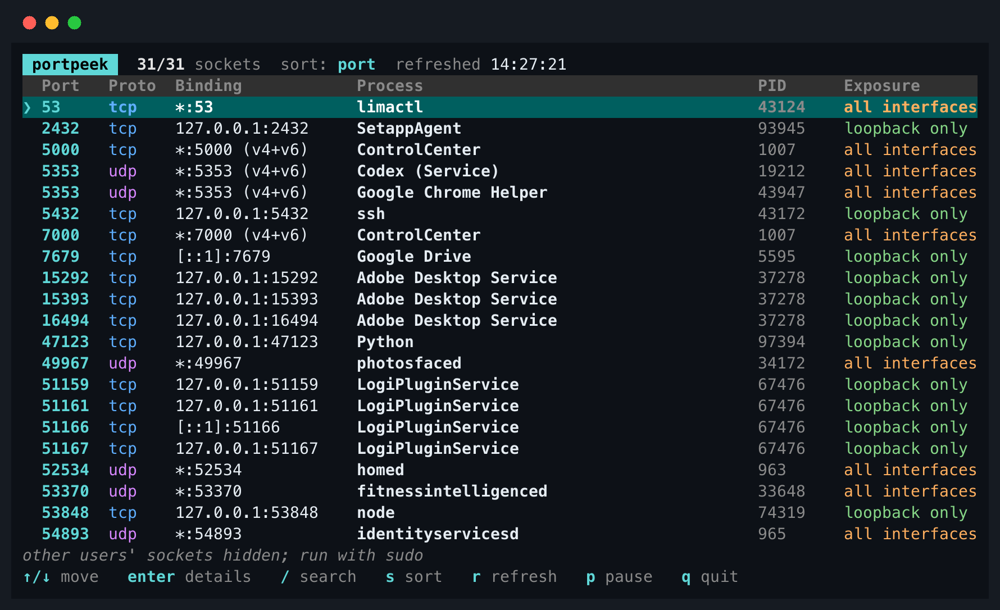
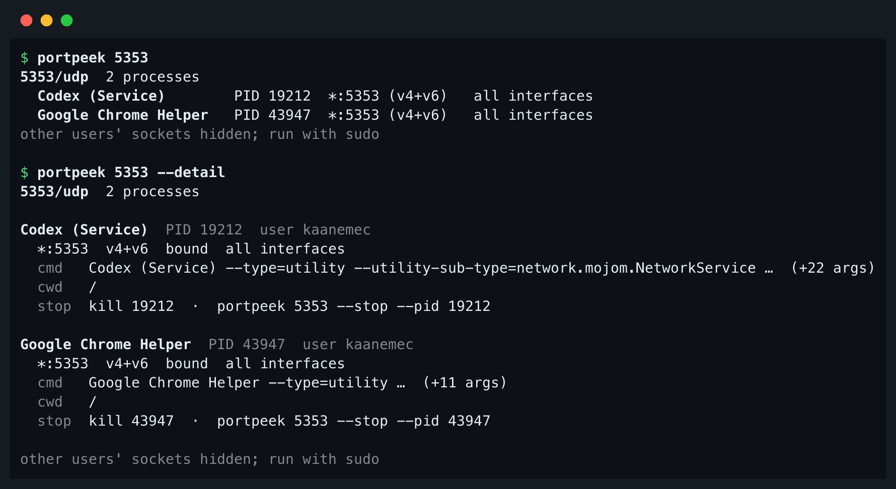
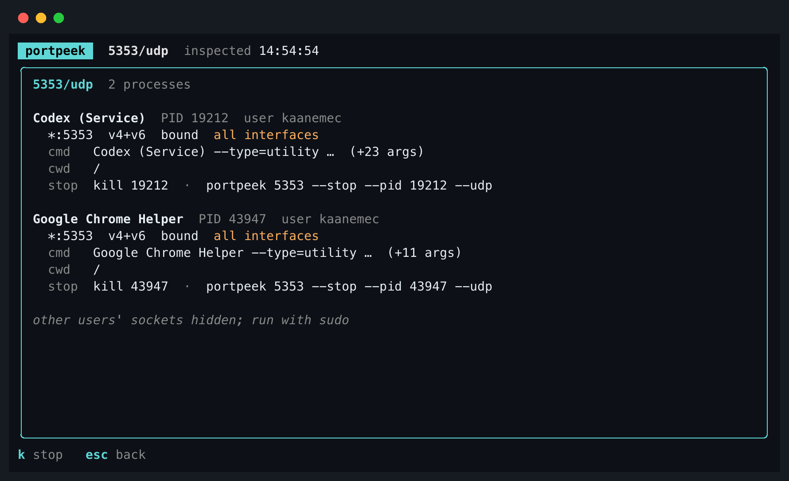

# Port Peek

**What is using this port?** Port Peek names the local process that owns a port
and how its socket is bound, on macOS, Linux and Windows.

[](https://github.com/kaanemec/portpeek/actions/workflows/ci.yml)
[](https://github.com/kaanemec/portpeek/releases/latest)
[](LICENSE)



## Install

macOS and Linux:

```sh
curl -fsSL https://raw.githubusercontent.com/kaanemec/portpeek/main/install.sh | sh
```

The script picks the right archive, verifies its SHA-256 checksum and installs
to `/usr/local/bin` (or `~/.local/bin` if that is not writable). It never runs
`sudo`. To pin a version or choose the directory, set variables for `sh`:

```sh
curl -fsSL https://raw.githubusercontent.com/kaanemec/portpeek/main/install.sh | PORTPEEK_VERSION=v1.2.2 PORTPEEK_INSTALL_DIR="$HOME/bin" sh
```

With Go 1.27 or newer, on any platform:

```sh
go install github.com/kaanemec/portpeek/cmd/portpeek@latest
```

Windows: download `portpeek_<version>_windows_amd64.zip` from
[Releases](https://github.com/kaanemec/portpeek/releases/latest), unpack it and
put `portpeek.exe` on your `PATH` (or use the `go install` line above).

Every release ships `checksums.txt`; manual verification steps are in
[docs/reference.md](docs/reference.md#verifying-a-release).

## Usage

```
$ portpeek 3000
3000/tcp  Python  (PID 13337)
  127.0.0.1:3000   listening   loopback only
  Python -m http.server 3000 --bind 127.0.0.1
  stop: kill 13337
other users' sockets hidden; run with sudo
```

`--detail` adds the user, working directory and both stop commands:

```
$ portpeek 3000 --detail
3000/tcp  Python  PID 13337  user kaanemec
  127.0.0.1:3000  v4  listening  loopback only
  cmd   Python -m http.server 3000 --bind 127.0.0.1
  cwd   /Users/kaanemec/Developer/Port-Peek
  stop  kill 13337  ·  portpeek 3000 --stop

other users' sockets hidden; run with sudo
```

On a terminal the output is styled; several processes on one port get one row
each:



`portpeek tui` opens a searchable table of every local port that refreshes every
5 seconds (`--interval` to change). Keys: `↑/↓` move · `/` search · `s` sort ·
`r` refresh · `p` pause · `Enter` details · `k` stop (in details) · `q` quit.



There is also a [light-terminal variant](docs/tui-light.png).

For scripts, `--json` prints a versioned document (schema 1); see
[docs/json.md](docs/json.md):

```
$ portpeek 3000 --json | grep -E '"(complete|pid|exposure)"'
  "complete": false,
        "pid": 13337,
          "exposure": "loopback"
```

`portpeek 3000 --stop` asks for confirmation (`--force` in scripts), checks
again that the same process still owns the port, and sends SIGTERM. It never
sends SIGKILL; if the process is still running after 2 seconds it prints
`kill -9 <pid>` for you to decide.

## What it tells you

- **Owner**: process name, PID and user, for every process that holds the port.
- **Command**: the command line (shortened to one line; full in `--json`) and
  working directory.
- **Binding**: address, protocol and state (`listening` or `bound`), with IPv4
  and IPv6 of the same address shown as `(v4+v6)`.
- **Exposure**: `loopback only`, `all interfaces` or `interface <address>`,
  derived from the bound address; it says nothing about firewalls.
- **Honest gaps**: without root, other users' sockets are hidden (macOS) or
  shown without an owner (Linux); Port Peek says so in a hint line and
  `"complete": false` instead of claiming the port is free. Fields it cannot
  read are marked unavailable with a reason, never guessed.

## Platforms

| OS | Source | Notes |
|---|---|---|
| macOS | `lsof` + `ps` | other users' sockets need `sudo` |
| Linux | `ss` + `/proc` | other users' sockets show as an unknown owner without root |
| Windows | `netstat` + PowerShell | `--stop` not supported yet; verified by the CI live test |

Manual checks with real output are in [docs/validation.md](docs/validation.md).

## Safety

- Read-only by default: it runs the OS tools above and changes nothing.
- Stopping happens only with `--stop` (or `k` in the TUI) after confirmation,
  rechecks the process identity right before signalling, and sends SIGTERM only.
- No telemetry and no network access.

## More

- [docs/reference.md](docs/reference.md): every option, output format, exit
  codes, permissions per OS, limitations
- [docs/json.md](docs/json.md): JSON contract and compatibility policy
- [CHANGELOG.md](CHANGELOG.md): release notes
- [ARCHITECTURE.md](ARCHITECTURE.md): design and decisions
- [roadmap/](roadmap/README.md): what was planned and built, version by version

## License

[MIT](LICENSE)
